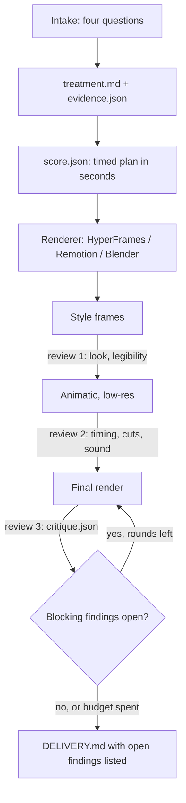

# motion-design

A Claude Code skill that plans a video before the build and reviews the render after. It works with HyperFrames, Remotion and Blender. It does not render.

**Status: in development.** The spec, the review scripts and a timing fixture are done. The skill text, the renderer adapters and the first test film are next.

## Why

Agents can now build clean video in code. The result still looks generated: text fades up, layouts are centred, three features get listed, and the copy opens with "Introducing…". The agent builds before it decides. A creative director, a motion designer and a copywriter decide first.

This skill makes the agent decide, write the decisions down, and keep to them. It does not set a house style. The film's own plan and references set the style.

## Flow

- **Intake.** Who watches and where. What they should remember and do next. What they should feel. What the video will not do.
- **Treatment.** One proposition, the last beat written first, named reference films, a small motion vocabulary, and an evidence ledger. The ledger marks each claim as fact, inference or metaphor.
- **Score.** Beats, on-screen text, voiceover, holds, transitions and sound cues, in seconds, so any renderer can use it.
- **Review.** Scripts measure what they can. The agent inspects frames for what scripts cannot judge.

## Review rules

- Each finding is `pass`, `fail`, `needs_review` or `not_applicable`. An uncertain result is `needs_review`. It is never a pass.
- Only five kinds of finding can block delivery:
  - **integrity:** decode, size, fps, duration
  - **communication:** text readable in time and at viewing size
  - **evidence:** unsupported claims
  - **sound integrity:** clipping, loudness, gaps
  - **fidelity:** did the render do what its own plan said?
- Craft numbers from the research (hold ratios, pace, reading speed, stock phrases) are defaults. They give advice only, and a plan can override any of them with a reason.
- A critique records the render's sha256 and the plan version. A critique of another file or an older plan does not count.

## Built so far

| Script | Does |
|---|---|
| `scripts/check.py` | Reviews a render against its plan and writes `critique.json` |
| `scripts/frames.py` | Takes the review samples and makes contact sheets, including one at phone width |
| `scripts/motion_strip.py` | Measures activity per frame, cuts and still holds |
| `scripts/audio_check.py` | Measures loudness, true peak, clipping, silences and onsets |
| `scripts/deliver.py` | Writes `DELIVERY.md`; exits non-zero on a stale critique or open blocking findings |

`fixtures/timing/` holds a 5-second test with three plates, two hard cuts and one silence. Each renderer adapter must hit its events within ±2 frames. There are 8 tests, and all pass.

The full design is in [SPEC.md](SPEC.md).

## Next

1. A test film, taken through the whole loop.
2. SKILL.md and the `references/` files, written from what that film needed.
3. HyperFrames, Remotion and Blender adapters, checked against the timing fixture.
4. Proof:
   - the same brief made with the skill and without it, judged blind
   - a second brief with different references, to check that the films do not look alike.

## What it does not do

- Render video, or generate it with AI video models.
- Certify aesthetic quality. Scripts measure; judgement stays judgement.
- Character animation or UI micro-interactions.

## Licence

MIT
