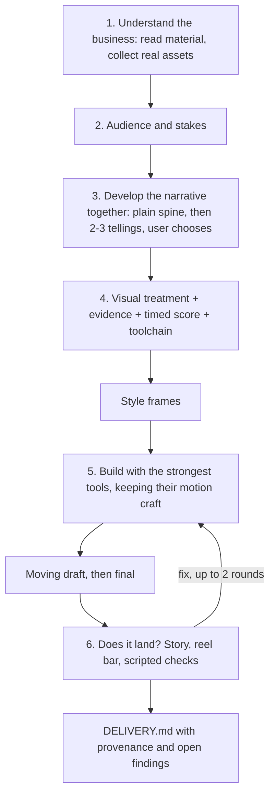

# motion-design

**Status: failed experiment, parked. Updated 30 September 2026.**

This project tested whether a directing skill could help frontier models make better motion-design films. It did not demonstrate a reliable improvement worth the extra process. We stopped developing this approach. The code and notes remain available for inspection, but we do not recommend this as a proven film-making workflow.

## Summary for new readers

### What we tried

The skill added a professional-style process around an agent. It covered business research, audience, story, visual treatment, tool choice and render review. It included a mandatory signature moment and a showreel quality target. Python scripts checked timing, readability plans, audio measurements and whether reviews matched the delivered files.

The hypothesis was that better decisions before rendering would produce better films. We tested it with Claude Opus, using HyperFrames and, in later runs, Blender. Most early client conversations used separate model agents. A later test involved Andy directly in the story decisions.

### What happened

| Test | Result |
|---|---|
| Tidewater sting | Andy preferred the baseline by a wide margin. The skill gave the film a clearer idea but weaker motion. |
| Common organiser film | A blind model judge scored both films 33/50 and preferred the baseline for comprehension. The skill film introduced the product too late. |
| Common rerun after fixes | A second blind model judge preferred the skill, 34–28. It improved brand fit, readability and craft, but comprehension still trailed the baseline. Neither met the showreel target. |
| dig film | The skill selected Blender and produced a different visual treatment. Andy stopped a later revision during rendering. There was no blind judgement. |
| Live story test with Andy | An agreed plain story did not produce a film Andy wanted. Checks caught small faults, but the trailer rework used familiar filmmaking imagery: film stock, a red pencil and letters in fog. Andy rejected it and said the skill did not seem to help. |
| Separate, minimal Common intervention | With the old skill excluded, a new run followed one session from creation to outcome. Andy found the flow cooler, but saw nothing beyond what ordinary Opus prompting could achieve. This did not justify a new skill. |

An additional film about the early experiment was made, but it did not provide independent evidence of improvement.

### What earned its place

Some checks were useful. Audience questions exposed the real organiser problem in the Common rerun. Checks at viewing size caught small text and invisible demonstrations. A fresh reader caught unclear language and misleading visual changes. The evidence ledger helped separate sourced claims from fictional demo data.

These benefits were limited. Readers also made mistakes. The evidence ledger missed an unsupported promise in the live-test story. Review hashes bound assessments to the correct files, but could not establish the quality of those assessments. Audio measurements did not substitute for listening.

### Why we stopped

The treatment, signature moment and showreel requirements did not reliably produce better creative choices. Agents spent effort satisfying the process and polishing familiar images. Adding rules after each failure increased the workload without establishing a corresponding improvement in the films.

This is our interpretation of the runs, not a proven explanation of model behaviour. The practical result was enough to stop: the full skill did not earn its overhead. The smaller continuity intervention produced a useful revision, but no clear value beyond an ordinary prompt.

**The relevant benchmark is a frontier model with normal feedback and its usual production tools.** Beating an unedited first attempt is not enough to justify a skill.

### What the evidence does and does not establish

This was a small creative experiment, not a controlled benchmark. There was generally one run per arm. Different judges scored the same Common baseline 33 and 28. Early clients were simulated. The live test had no matched baseline, so its outcome records Andy's assessment rather than a measured comparison.

The separate Common intervention used different tool versions and an unverified baseline model version. It also read the baseline's build log and contact sheet, which could anchor its choices. Its result cannot be attributed solely to the added instruction.

We did not establish that directing skills can never help. We established no reliable benefit from this implementation sufficient to continue developing it. Passing software tests does not establish creative quality. The real-renderer timing fixtures also remain untested.

### What is in this repository

The original skill, review scripts, adapters, tests and historical notes are preserved. Some individual tools may be useful independently. No replacement skill has been built or validated. The original claims and instructions below describe the experiment's design, not a current recommendation.

Test films, client exchanges and private project material remain local and are not included here.

Further reading:

- [Earlier tests and handover](docs/HANDOVER-2026-09-28.md): tests 1–3, findings and the next steps proposed at that time.
- [Live-test handover, PR #6](https://github.com/b1rdmania/motion-design/pull/6): the later run with Andy. This handover remains on its PR branch at the time of this update.
- [Original specification](SPEC.md): design, review contracts and early test results.
- [Original skill](SKILL.md): the workflow that was tested.

---

## Historical design

The skill aimed to help a user develop a story and turn it into showreel-quality motion design. It did not render. The agent built with tools such as HyperFrames, Remotion, Blender and ffmpeg. The workflow below preserves that original design.

## Flow



- **Discovery and narrative come first.** The questions are central when the story is unclear, and light when the user arrives with a clear brief.
- **The bar is showreel quality.** Think of the piece a senior motion designer puts first in their reel, or sends to audition for an A24 trailer. That is a standard of craft, not a house style.
- **Tools are chosen per shot for quality.** Blender for light and camera; HyperFrames or Remotion for type and UI; often a combination. The plan owns what the film says and when. The tools own how it moves.
- **Real assets.** Brand fonts, SVGs and colours come from the project and are loaded from their files.

## Review

Scripts support the judgement; they do not replace it.

- Each finding is `pass`, `fail`, `needs_review` or `not_applicable`. An uncertain result stays `needs_review` until someone inspects it and records a decision.
- Five kinds of finding can block delivery:
  - **integrity:** decode, size, fps, duration
  - **communication:** the planned reading-speed gate, and text readable at viewing size
  - **evidence:** unsupported claims, and sample data shown as real
  - **sound integrity:** clipping, declared loudness, gaps
  - **fidelity:** the render does what its plan says, and embedded footage matches its source.
- Craft prompts only advise. The judged questions record an assessment; they do not establish that the skill improves a film.
- A critique records the render's sha256 and the plan version. A critique of another file or an older plan does not count.

| Script | Does |
|---|---|
| `scripts/check.py` | reviews a render or style frames against the plan; writes `critique.json` |
| `scripts/resolve.py` | records a reviewer decision or an accepted limit |
| `scripts/deliver.py` | writes `DELIVERY.md` with provenance; exits non-zero on a stale critique or open blocking findings |
| `scripts/frames.py` | review samples (always frame 0) and contact sheets, including one at phone width |
| `scripts/motion_strip.py` | activity per frame, cuts and still runs |
| `scripts/audio_check.py` | loudness, true peak, silences, onsets and bass entries |
| `scripts/beatmap.py` | a heuristic audiomap for music-led films (numpy only) |

## Layout

```
SKILL.md       the six-step workflow
references/    assets, treatment, evidence, score, copy, motion, sound, toolchain, review, defaults, setup
adapters/      notes for HyperFrames, Remotion and Blender
scripts/       review scripts
fixtures/      a 5-second timing fixture
tests/         the review regression suite
```

## Requirements

Planning needs nothing installed. Automated review needs Python 3, NumPy, Pillow, ffmpeg and ffprobe ([setup](references/dependencies.md)). Renderers and audio services are optional and chosen per film ([setup](references/tool-setup.md)).

## What it does not do

- Render video, or generate it with AI video models.
- Certify aesthetic quality.
- Character animation or UI micro-interactions.

## Licence

MIT
