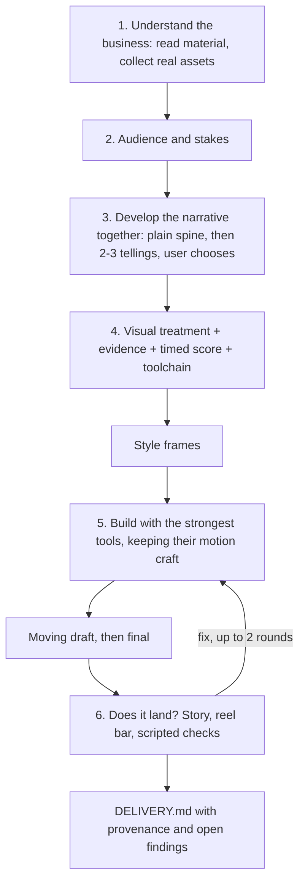

# motion-design

A Claude Code skill that helps a user work out what their video should say, then turns that story into showreel-quality motion design. It works like a creative director, motion designer and copywriter: discovery, narrative, visual treatment, toolchain choice and review. It does not render. The agent builds with whatever tools suit each shot, such as Blender, HyperFrames, Remotion or ffmpeg.

**Status: in development.** The skill has made two test films. What they showed, and what changed as a result, is recorded in [SPEC.md](SPEC.md#proof-plan).

## Why

Agents can now build clean video in code. The result still looks generated: text fades up, layouts are centred, three features get listed, and the copy opens with "Introducing…". The agent builds before it decides what the film is for. A creative director, a motion designer and a copywriter decide first.

## Flow



- **Discovery and narrative come first.** The questions are central when the story is unclear, and light when the user arrives with a clear brief.
- **The bar is showreel quality.** Think of the piece a senior motion designer puts first in their reel, or sends to audition for an A24 trailer. That is a standard of craft, not a house style.
- **Tools are chosen per shot for quality.** Blender for light and camera; HyperFrames or Remotion for type and UI; often a combination. The plan owns what the film says and when. The tools own how it moves.
- **Real assets.** Brand fonts, SVGs and colours come from the project and are loaded from their files.

## Review

Scripts support the judgement; they do not replace it.

- Each finding is `pass`, `fail`, `needs_review` or `not_applicable`. An uncertain result stays `needs_review` until someone inspects it and records a decision.
- Five kinds of finding can block delivery:
  - **integrity:** decode, size, fps, duration
  - **communication:** the planned reading-speed gate, and text readable at viewing size
  - **evidence:** unsupported claims, and sample data shown as real
  - **sound integrity:** clipping, declared loudness, gaps
  - **fidelity:** the render does what its plan says, and embedded footage matches its source.
- Craft prompts only advise. The judged questions ("does the story come through?", "would this go first in a reel?") are where a film gets better.
- A critique records the render's sha256 and the plan version. A critique of another file or an older plan does not count.

| Script | Does |
|---|---|
| `scripts/check.py` | reviews a render or style frames against the plan; writes `critique.json` |
| `scripts/resolve.py` | records a reviewer decision or an accepted limit |
| `scripts/deliver.py` | writes `DELIVERY.md` with provenance; exits non-zero on a stale critique or open blocking findings |
| `scripts/frames.py` | review samples (always frame 0) and contact sheets, including one at phone width |
| `scripts/motion_strip.py` | activity per frame, cuts and still runs |
| `scripts/audio_check.py` | loudness, true peak, silences, onsets and bass entries |
| `scripts/beatmap.py` | a heuristic audiomap for music-led films (numpy only) |

## Layout

```
SKILL.md       the six-step workflow
references/    assets, treatment, evidence, score, copy, motion, sound, toolchain, review, defaults, setup
adapters/      notes for HyperFrames, Remotion and Blender
scripts/       review scripts
fixtures/      a 5-second timing fixture
tests/         the review regression suite
```

## Requirements

Planning needs nothing installed. Automated review needs Python 3, NumPy, Pillow, ffmpeg and ffprobe ([setup](references/dependencies.md)). Renderers and audio services are optional and chosen per film ([setup](references/tool-setup.md)).

## What it does not do

- Render video, or generate it with AI video models.
- Certify aesthetic quality.
- Character animation or UI micro-interactions.

## Licence

MIT
