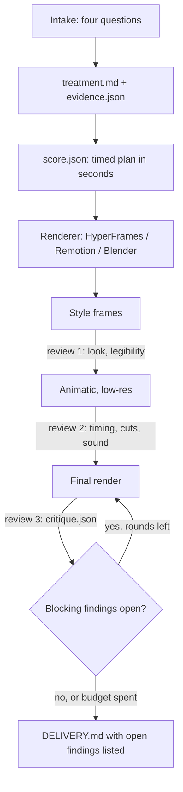

# motion-design

A Claude Code skill that plans a video before the build and reviews the render after. It works with HyperFrames, Remotion and Blender. It does not render.

**Status: in development.** A draft of the skill, its references and three renderer adapters exist, together with the review scripts and a timing fixture. The skill has not yet made a film.

## Dependencies

Planning and qualitative critique require no renderer or audio service. Automated review needs Python 3.12, NumPy, Pillow, FFmpeg and ffprobe. Tests also need pytest and Bash. Build with only the renderer you choose. No ElevenLabs account, API key or paid audio provider is required. See [setup and optional integrations](references/dependencies.md).

## Why

Agents can now build clean video in code. The result still looks generated: text fades up, layouts are centred, three features get listed, and the copy opens with "Introducing…". The agent builds before it decides. A creative director, a motion designer and a copywriter decide first.

This skill makes the agent decide, write the decisions down, and keep to them. It does not set a house style. The film's own plan and references set the style.

## Flow



- **Intake.** Who watches and where. What they should remember and do next. What they should feel. What the video will not do.
- **Treatment.** One proposition, the last beat written first, named reference films, a small motion vocabulary, and an evidence ledger. The ledger marks each claim as fact, inference or metaphor.
- **Score.** Beats, on-screen text, voiceover, holds, transitions and sound cues, in seconds, so any renderer can use it.
- **Review.** Scripts measure what they can. The agent inspects frames for what scripts cannot judge.

## Review rules

- Each finding is `pass`, `fail`, `needs_review` or `not_applicable`. An uncertain result remains `needs_review` until supported by a recorded reviewer decision.
- Only five kinds of finding can block delivery:
  - **integrity:** decode, size, fps, duration
  - **communication:** text readable in time and at viewing size
  - **evidence:** unsupported claims
  - **sound integrity:** clipping, loudness, gaps
  - **fidelity:** did the render do what its own plan said?
- Craft prompts (reading effort, stock phrases and opt-in rhythm hints) are advice only. No fixed hold/build ratio, transition style, reference quota or music provider is required.
- A critique records the render's sha256 and the plan version. A critique of another file or an older plan does not count. Reviewer decisions are stored separately from script observations; the delivery report lists only completed checks and recorded inspections.

## Built so far

| Script | Does |
|---|---|
| `scripts/check.py` | Reviews a render against its plan and writes `critique.json` |
| `scripts/frames.py` | Takes the review samples and makes contact sheets, including one at phone width |
| `scripts/motion_strip.py` | Measures activity per frame, cuts and still holds |
| `scripts/audio_check.py` | Measures loudness, true peak, near-full-scale samples, silences and onsets |
| `scripts/resolve.py` | Records a reviewer decision while preserving the script observation and updating the summary |
| `scripts/deliver.py` | Writes `DELIVERY.md`; exits non-zero on a stale critique or open blocking findings |

`fixtures/timing/` holds a 5-second test with three plates, two hard cuts and one silence. Each renderer adapter must hit its events within ±2 frames. The review regression suite also covers detector uncertainty, stereo cancellation, silence boundaries and review receipts; run it with the commands in `references/dependencies.md`. These tests do not establish aesthetic quality or adapter compatibility.

The full design is in [SPEC.md](SPEC.md).

## Layout

```
SKILL.md       the procedure: intake, treatment, score, handoff, review, delivery
references/    treatment, evidence, score, copy, motion, sound, review, defaults
adapters/      how the score maps onto HyperFrames, Remotion and Blender
scripts/       the review scripts
fixtures/      the timing fixture
```

## Next

1. Test film: a fresh agent with only the installed skill makes a film from a real brief. The places where it gets stuck show the gaps in the skill text.
2. Run each adapter against the timing fixture. At the moment each one says "not yet run".
3. Proof:
   - the same brief made with the skill and without it, judged blind
   - a second brief with different references, to check that the films do not look alike.

## What it does not do

- Render video, or generate it with AI video models.
- Certify aesthetic quality. Scripts measure; judgement stays judgement.
- Character animation or UI micro-interactions.

## Licence

MIT
